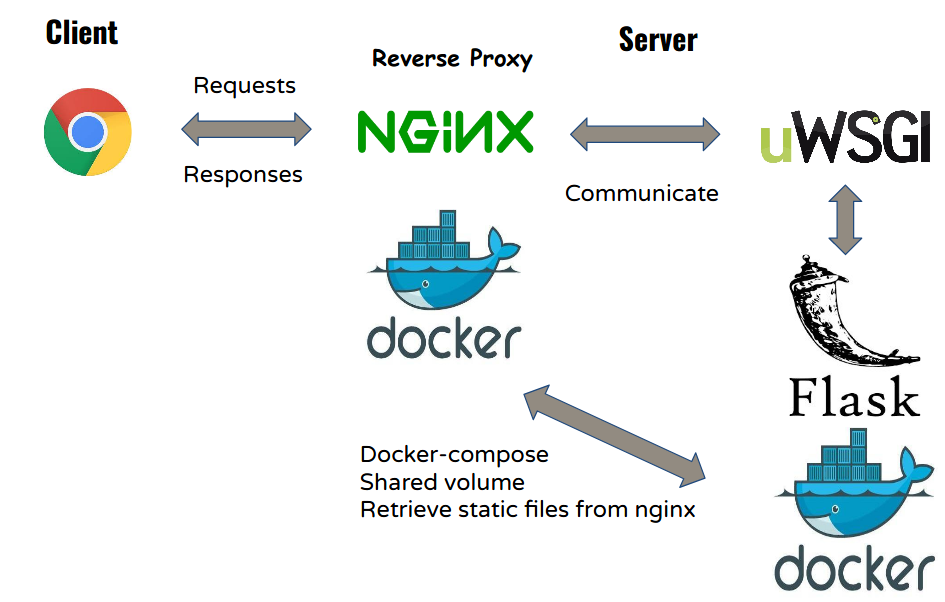

**Static File Host**
----
The static file host server hosting the static files of courses built [roman](https://github.com/apluslms/roman). 
It provides API allowing users to upload/update static files of courses to it.

 It is built with the help of [aplus-file-transfer](https://github.com/apluslms/apluslms-file-transfer) package.

### Architecture

 
  
* **Authentication**

  It applies JWT authentication with RS256 algorithm. A JWT token is encoded 
  by a private key in the service [shepherd](https://github.com/apluslms/shepherd).
  The token is sent in the Authorization header when making requests to the API, 
  and this server provides a public key in PEM format to decode and authenticate it. 
  
  An example of a public key:
    ```bash
    JWT_PUBLIC_KEY = """
    -----BEGIN PUBLIC KEY-----
    MIIBIjANBgkqhkiG9w0BAQEFAAOCAQ8AMIIBCgKCAQEA0QIB6wP5rGpT7pcKM0uQ
    bn3FbQI2Xp58vLW+eLISgPvh0EMNuVWMazRfTBGnSxYI2P2F+Yf+O8Ck3JWOpuCD
    +i0a+RlC7gZdspULHpRYSccOqvRdcMn93nuPxiHJ+zAFuVR6mmDQmkHR3ruFvbQt
    FWABpbZpqVOlaOUqoyQcp7JGOrrGZZhifS8EE56azvhIm8n2qf+KhKkTq0P71j+4
    3h2sZtHM9nrsm/wtyb26xPBwGS1v1d5bWw0D2vhPSCP4HV2DuI6WD6pEN9Axjf5j
    dG7tGa6GnyPchdDAvlnA1FQiFfkz4NQtL5upmGiz6gBslFlPhZmejlr2RUYd4mbQ
    3QIDAQAB
    -----END PUBLIC KEY-----
    """ 
    ```
   The payload of a JWT token generated by [shepherd](https://github.com/apluslms/shepherd) 
   includes the fields Subject, Issuer and Issued at. 
   The Subject field is the name of the course folder, and the Issuer field is restricted, `JWT_ISSUER = shepherd`. 
   An example of the payload component of a JWT token:
    ```bash
   {
   'sub': 'def_course', 
   'iss': 'shepherd',  
   'iat': 1562828304
   }
    ```
  The client also needs to provide a parameter `course_name` in the url, and whether the `course_name` 
  and the `sub` field are the same will also be checked.
  
* **Method:**
  
  `POST /<course_name>/select-files` - Select files of the course to upload
  
  `POST /<course_name>/upload-files` - Upload the files to a temporary course directory
  
  `POST /<course_name>/publish-files` - Upload the files to a temporary course directory
  
  To deploy static files of a course, first calling the endpoint `/<course_name>/select-files` 
  to decide which files to upload, and then calling the endpoint `/<course_name>/upload-files` to upload selected files.
  Finally calling `/<course_name>/publish-files` to publish the uploaded files to the server. 
  The docker container of deploying a course to the server is available in [aplus-file-transfer](https://github.com/apluslms/apluslms-file-transfer).
  
### Set up the server


    # to the root of repo
    cd static-file-host
    
    # build the images
    docker-compose build

    # start up the server
    docker-compose up

Visit http://localhost:7000/ (or replace `localhost` with the `docker0` IP address). 
Currently only the name list of uploaded courses in the server is showed.

Visit http://localhost:7000/courses/ to see the uploaded files (it lists the directory `/server_app/courses/` that hosting static files in the `nginx` container).

### For develop and test the Flask app alone
                             
    # to the root of repo    
    cd static-file-host/server_app      
                             
    # in your vitrualenv       
    pip install -r requirements.txt
    # or
    # pip3 install -r requirements.txt
    
    # development mode
    export FLASK_ENV=development
    
    # run the app
    python app.py
    # or
    # python3 app.py    
    
   Visit http://localhost:5000/